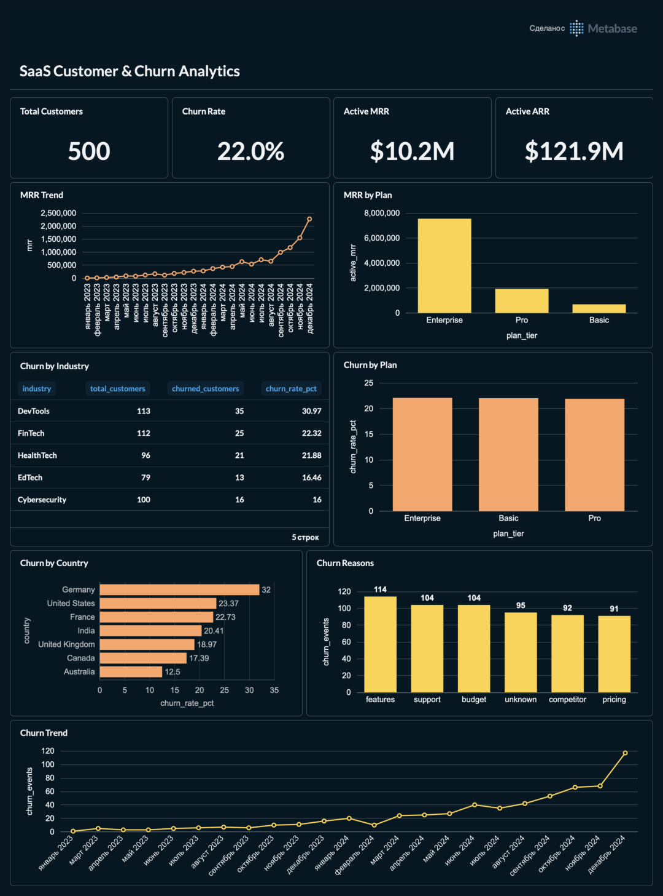
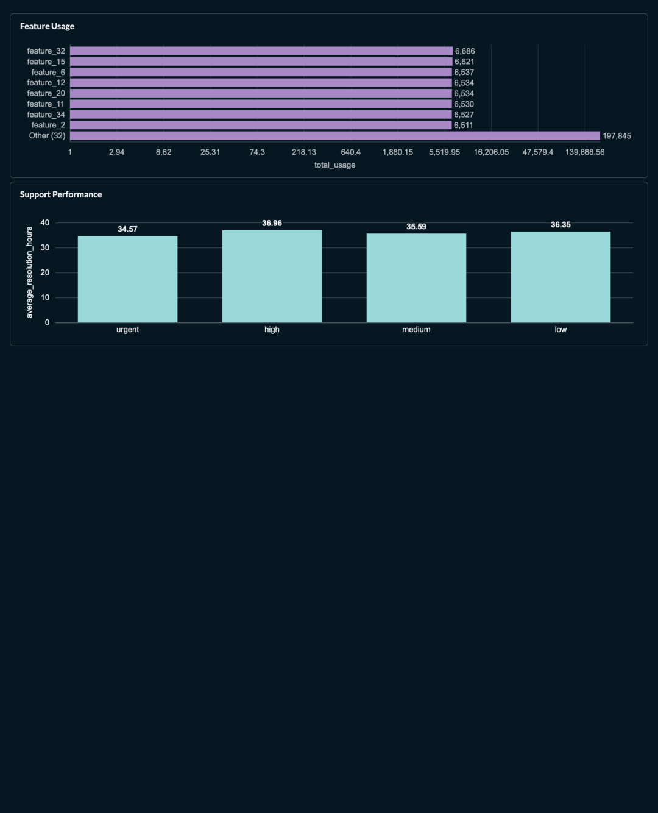

# SaaS Customer & Churn Analytics

## О проекте

Аналитический проект по исследованию SaaS-бизнеса с фокусом на клиентскую базу, подписки, выручку, churn, использование продукта и работу службы поддержки.

Цель проекта — определить характеристики клиентского оттока, оценить его потенциальное финансовое влияние и сформировать направления для дальнейшего анализа удержания клиентов.

Проект объединяет **PostgreSQL / SQL, Python и BI-визуализацию в Metabase**.

---

## Бизнес-задачи

В рамках проекта выполнены:

* анализ клиентской базы и подписок;
* анализ активных подписок и тарифов;
* расчёт MRR и ARR;
* расчёт churn rate;
* анализ churn по тарифам, отраслям и странам;
* анализ зарегистрированных причин churn;
* анализ churn events после upgrade и downgrade;
* анализ реактиваций;
* оценка финансового воздействия churn;
* анализ использования функций продукта;
* анализ ошибок и error rate;
* анализ обращений в поддержку;
* оценка first response time, resolution time, satisfaction и escalations;
* статистическая проверка потенциальных факторов churn;
* формирование бизнес-рекомендаций.

---

## Используемые инструменты

* **PostgreSQL / SQL** — агрегация данных и расчёт бизнес-метрик;
* **Python** — EDA и статистический анализ;
* **Metabase** — BI-dashboard и визуализация результатов;
* **Git / GitHub** — хранение и версионирование проекта.

---

## Структура проекта

```text
10_SaaS Customer & Churn Analytics/

├── README.md
├── conclusions.md
├── Dashboard/
│   ├── .gitkeep
│   └── Metabase - SaaS Customer & Churn Analytics.pdf
├── python/
│   ├── .gitkeep
│   ├── 01_eda.py
│   └── 02_statistical_analysis.py
└── sql/
    ├── .gitkeep
    ├── 01_data_overview.sql
    ├── 02_customer_analysis.sql
    ├── 03_revenue_analysis.sql
    ├── 04_churn_analysis.sql
    └── 05_product_and_support_analysis.sql
```

Исходные CSV-файлы не включены в GitHub-репозиторий.

---

# SQL-анализ

## 01. Data Overview

Файл:

```text
sql/01_data_overview.sql
```

Анализ включает:

* количество клиентов;
* количество подписок;
* количество churn events;
* количество записей использования функций;
* количество обращений в поддержку;
* временные периоды;
* Active MRR и Active ARR;
* распределение клиентов по тарифам.

---

## 02. Customer Analysis

Файл:

```text
sql/02_customer_analysis.sql
```

Анализ включает:

* клиентскую базу;
* churn rate;
* churn по тарифам;
* churn по отраслям;
* churn по странам;
* сравнение клиентских сегментов.

---

## 03. Revenue Analysis

Файл:

```text
sql/03_revenue_analysis.sql
```

Анализ включает:

* активные подписки;
* Active MRR;
* Active ARR;
* средний MRR на активную подписку;
* MRR по тарифам;
* долю MRR по тарифам;
* MRR по месяцам начала подписок.

---

## 04. Churn Analysis

Файл:

```text
sql/04_churn_analysis.sql
```

Анализ включает:

* зарегистрированные причины churn;
* количество churn events;
* refunds;
* churn events после upgrade;
* churn events после downgrade;
* reactivation;
* monthly churn;
* оценку финансового воздействия churn.

---

## 05. Product & Support Analysis

Файл:

```text
sql/05_product_and_support_analysis.sql
```

Анализ включает:

* использование функций продукта;
* количество ошибок;
* error rate;
* количество обращений в поддержку;
* first response time;
* resolution time;
* satisfaction;
* escalations;
* показатели поддержки по приоритетам.

---

# Python-анализ

## EDA

Файл:

```text
python/01_eda.py
```

Выполнены:

* загрузка данных;
* проверка типов данных;
* анализ пропусков;
* проверка дубликатов;
* описательная статистика;
* расчёт основных бизнес-метрик;
* анализ churn-сегментов;
* анализ причин churn;
* оценка финансового воздействия churn.

---

## Statistical Analysis

Файл:

```text
python/02_statistical_analysis.py
```

Для проверки потенциальных факторов churn использовались:

* **Chi-square test** — для категориальных признаков;
* **Mann–Whitney U test** — для числовых признаков.

Проверялись:

* тариф;
* отрасль;
* страна;
* размер клиента (`seats`);
* MRR.

Уровень статистической значимости:

```text
α = 0.05
```

---

# Основные результаты

## Customer & Churn

| Метрика           |   Значение |
| ----------------- | ---------: |
| Клиенты           |    **500** |
| Подписки          |  **5,000** |
| Активные подписки |  **4,514** |
| Churned customers |    **110** |
| Churn rate        | **22.00%** |

Один клиент может иметь несколько churn events, поэтому количество churned customers не равно количеству churn events.

Всего зарегистрировано **600 churn events**.

---

## Revenue

| Метрика                          |         Значение |
| -------------------------------- | ---------------: |
| Active MRR                       |  **$10,159,608** |
| Active ARR                       | **$121,915,296** |
| Средний MRR на активную подписку |    **$2,250.69** |

Текущие подписки клиентов, у которых были churn events, связаны с:

* **MRR — $2,355,245**
* **ARR — $28,262,940**
* **23.18% текущего MRR**

Это оценка финансового воздействия на основе связанных текущих подписок, а не фактически потерянная выручка.

Для точной оценки финансового эффекта необходимо учитывать MRR непосредственно на дату churn и период после оттока.

---

# Churn Analysis

## Churn by Plan

| Plan       |  Churn |
| ---------- | -----: |
| Enterprise | 22.08% |
| Basic      | 22.02% |
| Pro        | 21.91% |

Churn практически одинаков для всех тарифов.

---

## Churn by Industry

| Industry      |  Churn |
| ------------- | -----: |
| DevTools      | 30.97% |
| FinTech       | 22.32% |
| HealthTech    | 21.88% |
| EdTech        | 16.46% |
| Cybersecurity | 16.00% |

DevTools имеет наиболее высокий наблюдаемый churn — **30.97%**.

При этом Chi-square test дал:

```text
p-value = 0.0657
```

При `α = 0.05` статистически значимая связь между отраслью и churn не подтверждается.

Поэтому DevTools рассматривается как **сегмент для дальнейшего исследования**, а не как доказанный фактор churn.

---

## Churn by Country

| Country        |  Churn |
| -------------- | -----: |
| Germany        | 32.00% |
| United States  | 23.37% |
| France         | 22.73% |
| India          | 20.41% |
| United Kingdom | 18.97% |
| Canada         | 17.39% |
| Australia      | 12.50% |

Chi-square test:

```text
p-value = 0.6588
```

Статистически значимая связь между страной и churn не подтверждается.

---

# Churn Reasons

Наиболее распространённые зарегистрированные причины churn events:

| Причина    | Churn events |  Доля |
| ---------- | -----------: | ----: |
| Features   |          114 | 19.0% |
| Budget     |          104 | 17.3% |
| Support    |          104 | 17.3% |
| Unknown    |           95 | 15.8% |
| Competitor |           92 | 15.3% |
| Pricing    |           91 | 15.2% |

Причины распределены относительно равномерно, и ни одна из них не формирует большинство churn events.

`Features` является наиболее частой зарегистрированной причиной и представляет направление для дальнейшего анализа продуктового поведения.

---

# Product Analytics

Error rate функций находится в диапазоне:

**4.71%–6.56%**

| Feature    | Error rate |
| ---------- | ---------: |
| Feature 4  |  **6.56%** |
| Feature 20 |  **4.71%** |

Для дальнейшего анализа необходимо исследовать связь между:

* использованием функций;
* ошибками;
* product engagement;
* снижением активности;
* последующим churn.

---

# Support Analytics

| Метрика                     |         Значение |
| --------------------------- | ---------------: |
| Support tickets             |        **2,000** |
| Average resolution time     |   **35.86 часа** |
| Average first response time | **88.48 минуты** |
| Average satisfaction        |     **3.98 / 5** |
| Escalations                 |           **95** |
| Escalation rate             |        **4.75%** |

Дополнительное направление анализа — исследование связи между обращениями в поддержку и последующим churn.

---

# Statistical Analysis

| Фактор  | Тест           |    P-value | Результат                       |
| ------- | -------------- | ---------: | ------------------------------- |
| Тариф   | Chi-square     | **0.9993** | Значимой связи нет              |
| Отрасль | Chi-square     | **0.0657** | Значимой связи нет при α = 0.05 |
| Страна  | Chi-square     | **0.6588** | Значимой связи нет              |
| Seats   | Mann–Whitney U | **0.6919** | Значимого различия нет          |
| MRR     | Mann–Whitney U | **0.6317** | Значимого различия нет          |

Ни один из проверенных факторов не продемонстрировал статистически значимой связи с churn при `α = 0.05`.

При этом отсутствие статистической значимости не означает отсутствия бизнес-различий. Это означает, что имеющихся статистических оснований недостаточно для подтверждения зависимости в рамках проведённых тестов.

---
## 📊 Dashboard Preview

### Executive Overview


### Revenue & Churn Analysis


# Key Findings

### 1. Churn rate составляет 22%

**110 из 500 клиентов** имеют churn flag.

### 2. Тарифы показывают практически одинаковый churn

Enterprise, Basic и Pro находятся примерно на одном уровне.

### 3. DevTools выделяется по наблюдаемому churn

Churn в DevTools составляет **30.97%** против **22%** в целом.

Статистическая значимость не подтверждена, поэтому сегмент требует дополнительного исследования.

### 4. Features — наиболее частая зарегистрированная причина churn events

На неё приходится **19.0% churn events**.

Это не доказывает причинно-следственную связь, но делает product experience одним из направлений для дальнейшего анализа.

### 5. Есть сегмент реактивированных клиентов

**61 из 600 churn events** являются реактивациями.

**Reactivation rate = 10.17%.**

### 6. Churn связан с существенной текущей финансовой ценностью

Текущие подписки клиентов с churn events связаны примерно с:

* **$2.36 млн MRR**
* **$28.26 млн ARR**

Эти значения являются оценкой на основе текущих связанных подписок, а не фактически потерянной выручкой.

---

# Recommendations

## 1. Product Churn Analysis

Исследовать:

* снижение использования функций перед churn;
* error rate;
* отсутствие активности;
* использование ключевых функций.

## 2. DevTools Analysis

Провести дополнительную сегментацию DevTools по:

* MRR;
* seats;
* product usage;
* support tickets;
* churn reasons.

## 3. Win-back Analysis

Изучить характеристики реактивированных клиентов:

* причина churn;
* время до реактивации;
* тариф после возвращения;
* MRR до и после возвращения.

## 4. Early Warning System

Для будущей модели churn можно использовать:

* снижение product usage;
* рост ошибок;
* обращения в поддержку;
* satisfaction;
* downgrade;
* inactivity;
* изменение MRR.

## 5. Financial Prioritization

Для будущих retention-кампаний целесообразно учитывать одновременно:

**Churn probability × MRR**

Такой подход позволяет учитывать не только вероятность оттока, но и потенциальную финансовую ценность клиента.

---

# Dashboard

Для визуального анализа создан dashboard в **Metabase**.

Основные блоки:

1. Executive KPI
2. Revenue & MRR
3. Customer & Churn Analysis
4. Churn Reasons
5. Product Usage
6. Support Performance

Финальная версия dashboard:

```text
Dashboard/Metabase - SaaS Customer & Churn Analytics.pdf
```

---

# Итог

Проект показал, что churn является существенной бизнес-проблемой: **22% клиентов имеют churn flag**.

При этом проверенные характеристики — тариф, страна, размер клиента (`seats`) и MRR — не показали статистически значимой связи с churn при `α = 0.05`.

Наиболее интересные направления для дальнейшего анализа:

1. product usage;
2. product errors;
3. DevTools;
4. support interactions;
5. поведение клиентов непосредственно перед churn;
6. reactivation и win-back;
7. predictive churn analysis.

Следующий этап проекта — перейти от ретроспективного анализа уже произошедшего churn к **предиктивному выявлению клиентов с повышенным риском оттока** и оценке потенциального финансового эффекта.

---

# Pipeline проекта

```text
SQL
 ↓
EDA
 ↓
Statistical Analysis
 ↓
Business Insights
 ↓
Metabase Dashboard
 ↓
Recommendations
 ↓
Predictive Churn Analysis
```
